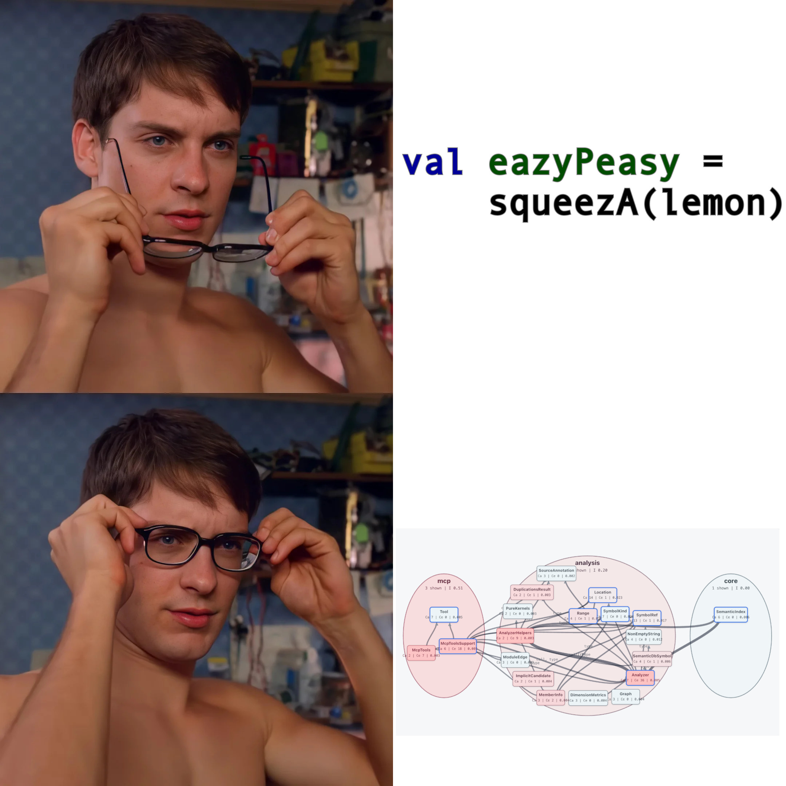

# AI in Scala is a Superpower: Beyond Basic Code Navigation



In my previous post, [*It Hurts to Watch an AI Grep My Scala*](it-hurts-to-watch-ai-grep-my-scala.md), I talked about why plain text search, like `grep`, is a bad tool when LLM agents navigate Scala codebases. String search cannot understand relationships, type-system guarantees, inferred types, summoned `given` instances, or renamed imports.

Once your AI assistant stops guessing with "grep" and gets direct access to the compiler's **SemanticDB**, what can it *actually* do?

Here is how **ScalaSemantic MCP** turns your AI assistant, whether Claude Code, Codex, or Antigravity, into a more precise Scala co-developer.

---

## ⚡ 1. Inline Semantic Enrichment (`annotated_source`)

When LLMs read a Scala codebase, they often have to guess what the compiler already knows. Sometimes they guess well, but guessing is still fragile. `annotated_source` gives the model the missing semantic information directly: inferred types, resolved givens, expanded imports, and other compiler-backed facts.

The `annotated_source` tool enriches files read on the fly before sending them to the model's context window:
* **Explicit Type Annotations**: Automatically inserts inferred types for `val`, `var`, and `def` declarations.
* **Summoned Givens & Implicits**: Explicitly names and binds summoned `given` instances by their type, eliminating mystery parameters.
* **Exploded Wildcard Imports**: Replaces wildcard imports (`import foo.bar.*`) with the exact symbols used in the file.
* **Diff Formatting (`format=diff`)**: Emits clean diff-style representations showing exactly what the compiler sees versus what is written on disk.

Take a look at what `annotated_source` adds to the code before the LLM reads it:


As shown in the screenshot above, it highlights exact semantic additions, such as inferred return types, parameter types, and summoned context bounds. The model no longer has to infer these details from raw source text.

---

## 🔍 2. Deep Structural Inspection & Project Relationships

Instead of forcing the LLM to open 10 files to understand relationships, ScalaSemantic provides targeted semantic query tools that extract project structure and dependencies.


Above, I visualize a tool-created graph of ScalaSemanticMCP's project relationships and module dependencies. Besides graph edges, it also contains useful graph metrics, such as node coupling, centrality, and depth. This helps an LLM reason about code much better than jumping between `grep` results.


---
## 3. What Else Can It Give to an LLM Agent?

| Tool                          | What It Does                                                                                             |
| :---------------------------- | :------------------------------------------------------------------------------------------------------- |
| **`value_flow`**              | Performs BFS graph traversal to trace where a variable or parameter originates and flows across methods. |
| **`source_around_position`**  | Pulls pinpointed, contextual source code around exact file coordinates without loading entire files.     |
| **`smart_code_duplications`** | Finds structural AST duplications across the project with highlighted source snippets.                   |
| **`method_call_hierarchy`**   | Traverses incoming callers and outgoing call chains across parent traits and overrides.                  |
| **`structure` (Mermaid)**     | Emits visual Mermaid module graphs for architecture visualization directly in chat markdown.             |

---

## 🚀 4. Zero-Config Build Tool Auto-Detection

ScalaSemantic requires **no sbt or Mill plugin installation**. It automatically detects `.semanticdb` files across **sbt**, **Mill**, and **Scala CLI** configurations out of the box.

```bash
# Run automatically via Scala CLI launcher
curl -sSL https://raw.githubusercontent.com/MercurieVV/ScalaSemantic/main/scalasemantic-mcp.sh | bash
```

### Try It Today
Connect ScalaSemantic to your AI coding environment and give your assistant true compiler-native understanding of your Scala codebase.
